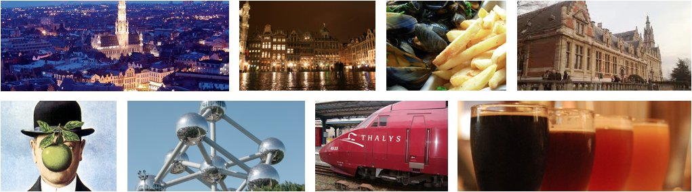

.. include:: common.txt

Euroscipy 2013, the 6th European meeting on Python in Science   
=============================================================

The EuroSciPy meeting is a cross-disciplinary gathering focused on the          
use and development of the Python language in scientific research and           
industry. This event strives to bring together both users and developers        
of scientific tools, as well as academic research and state of the art          
industry.

Main topics                                                                     
-----------
* Presentations of scientific tools and libraries using the Python language,
  including but not limited to:

 * vector and array manipulation                                               
 * parallel computing                                                          
 * scientific visualization                                                    
 * scientific data flow and persistence                                        
 * algorithms implemented or exposed in Python                                 
 * web applications and portals for science and engineering.                   

* Reports on the use of Python in scientific achievements or ongoing projects.

* General-purpose Python tools that can be of special interest to the

Tutorials                                                                       
---------
There will be two tutorial tracks at the conference, an introductory one,       
to bring up to speed with the Python language as a scientific tool, and         
an advanced track, during which experts of the field will lecture on            
specific advanced topics such as advanced use of numpy, paralllel               
computing, advanced testing...  
