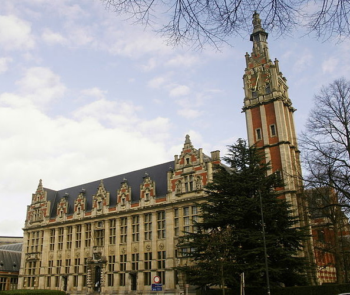

.. include:: header.txt
.. include:: menu.txt
.. include:: footer.txt

Location
========

| Université libre de Bruxelles
| Campus du Solbosch
| Avenue Franklin D. Roosevelt 50
| B-1050 Bruxelles

Campus Map
----------

.. image:: pictures/campus-map.png
   :scale: 50%
   :target: pictures/campus-map.png

Access from the airport
-----------------------

Up to 4 trains an hour connect the airport to the main train stations:

* Brussels Nord
* Brussels Central
* Brussels Midi.

The Airport Line Bus is an 30-minute express service between Brussels Airport
and the European quarter. Licensed Taxis are permanently available in front of
the arrivals hall

Access from train
-----------------

`Here <http://www.ulb.ac.be/campus/solbosch/docs/stib-solbosch.pdf>`_ is a map
of public transporation

Access by car
-------------

**From the Namur motorway (E411)**

At the end of the motorway, opposite the ULB sign located on the Plaine
campus, turn left; then, at the traffic lights, turn left again at the
Fraiteur bridge. Carry on straight ahead (Avenue de l'Université) to reach
the Solbosch campus.

**From the Liège motorway (E40)**

At the end of the motorway, follow the direction Bruxelles Sud (Brussels
South). At the end of the Boulevard Général Jacques, take Avenue Buyl or
Avenue Franklin Roosevelt to the left.

**From the Paris-Mons motorway (E19)**

Leave the motorway at Drogenbos and follow the direction Centre Ville (city
centre). At the entry to Avenue Brugmann (Square des Héros), turn right at
Avenue De Fré. Cross the Chaussée de Waterloo to enter the Bois de la Cambre
(the Cambre woods). Take the first turning to the right in the woods. At the
first crossroads, turn left and then take the first road to the right (Avenue
de l'Orée). Finally, drive straight on to Avenue Franklin Roosevelt. Turn left
to reach the campus.

A**From the Ostende motorway (E40)**

Follow the direction Centre Ville (city centre), then take the tunnels to the
exit to the Bois de la Cambre. Take the tunnel to the right and continue along
the full length of the Avenue Louise, which leads on into Avenue Franklin
Roosevelt, where the ULB is located.

**From the Antwerp motorway**

Take the Ring Ouest (RO) (Ring Road West) to the east up to the intersection of
the Liège motorway. Follow the direction Bruxelles Sud (Brussels South). At the
end of the Boulevard Général Jacques, turn into Avenue Buyl or Avenue Franklin
Roosevelt on the left.
