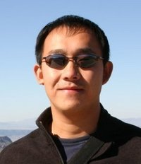

.. include:: common.txt

Keynote Speakers
================

Peter Z. Wang
-------------

Peter holds a B.A. in Physics from Cornell University and has been developing
applications professionally using Python since 2001. Before co-founding
`Continuum Analytics Inc. <continuum.io>`_ in 2011, Peter spent seven years at
`Enthought <http://enthought.com>`_ designing and developing
applications for a variety of companies, including investment bankers,
high-frequency trading firms, oil companies, and others. In 2007, Peter was
named Director of Technical Architecture and served as client liaison on
high-profile projects. Peter also developed `Chaco
<http://code.enthought.com/chaco/>`_, an open-source, Python-based toolkit for
interactive data visualization.
