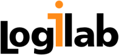

.. include:: header.txt
.. include:: menu.txt
.. include:: footer.txt

Sponsors
========

The purpose of NumFOCUS is to promote the use of accessible and reproducible
computing in science and technology. This is accomplished through:

* Educational Programs
* The promotion of high-level languages, reproducible scientific research, and
  open-code development
* An increase in collaborative research tools and documentation

----

Logilab are scientific computing and knowledge management specialists. They are well known in the Python community: as well as being a founding member of EuroPython they release development tools for community use, one of the best known being pylint, the Python source code checker. During EuroPython 2009 Logilab will be presenting their CubicWeb framework.

Logilab are sponsoring the signage for the event, so that you can get to the talks on time!

----

We work with you to develop software for interactive data manipulation and
visualization. In addition to full application development, we also offer
short-term consultation to address critical technical computing needs. Our
areas of expertise include geoscience, financial analysis, 3D modeling, fluid
dynamics and microrheology.
